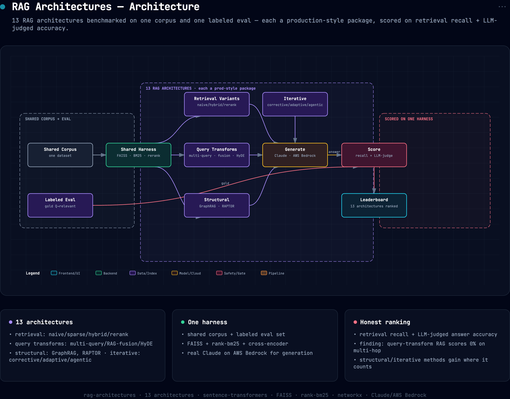

# rag-architectures

**13 RAG architectures, one corpus, one labeled eval set, engineered as a real framework and
measured side by side.** Each architecture is a self-contained, production-style package built on a
shared core (typed domain models, pluggable LLM/embedding/vector-store backends, retry + caching,
span tracing, structured-output repair). They all run over the same documents, embeddings and LLM,
so the comparison is honest: score differences are *architecture* differences, not infrastructure
differences.

```bash
cp .env.example .env          # add AWS Bedrock creds (or ANTHROPIC_API_KEY, see .env.example)
pip install -e ".[dev]"
rag-bench                     # run every architecture over the eval set, print the table
rag-bench --methods graphrag,agentic --limit 4 -v
pytest -q                     # 43 offline tests — no keys, no network, no model downloads
```


## Architecture



*Interactive/exportable version: [`docs/assets/architecture.html`](docs/assets/architecture.html).*

## The architectures

Each package has its own `README.md` (usage + honest findings) and `ARCHITECTURE.md` (mermaid data
flow grounded in the source paper, component table, failure modes, tuning guide).

| family | package | design | paper |
|---|---|---|---|
| **Retrieval** | [`naive/`](naive) | dense top-k, one pass, the baseline | Lewis et al. 2020 |
| | [`sparse/`](sparse) | BM25 with an explicit, configurable analysis pipeline | Robertson & Zaragoza 2009 |
| | [`hybrid/`](hybrid) | dense ∥ BM25 → RRF or normalized weighted fusion | Cormack et al. 2009 |
| | [`rerank/`](rerank) | high-recall candidates → cross-encoder precision funnel | Nogueira & Cho 2019 |
| **Query transform** | [`multi_query/`](multi_query) | LLM rephrasings → parallel retrieval → interleaved union |, |
| | [`rag_fusion/`](rag_fusion) | LLM broadenings → Reciprocal Rank Fusion consensus | Rackauckas 2024 |
| | [`hyde/`](hyde) | embed hypothetical answers, mix with the query vector | Gao et al. 2022 |
| **Indexing** | [`chunking/`](chunking) | strategy study: sentence-window / parent-child / contextual | Anthropic 2024 |
| **Structural** | [`graphrag/`](graphrag) | typed entity/relation graph → Louvain communities → local + global search | Edge et al. 2024 |
| | [`raptor/`](raptor) | GMM soft clustering → recursive summaries → collapsed-tree retrieval | Sarthi et al. 2024 |
| **Control flow** | [`corrective/`](corrective) | grade retrieval → refine strips / rewrite + fallback (CRAG) | Yan et al. 2024 |
| | [`adaptive/`](adaptive) | complexity classifier → no-retrieval / single-step / iterative chain | Jeong et al. 2024 |
| | [`agentic/`](agentic) | ReAct tool loop (search, keyword, read-doc) + evidence log | Yao et al. 2023 |

## The core framework

```
core/
  types.py                  Document · Chunk · Query · ScoredChunk · RetrievalResult ·
                            ContextBlock · GeneratedAnswer · PipelineResult
  errors.py                 taxonomy: ConfigurationError · ProviderError · RateLimitError ·
                            StructuredOutputError · …
  config.py                 env-layered settings (.env + ~/.env), retry policy, cache knobs
  telemetry.py              span tracer (OTel-shaped) + structured logging + counters
  llm/                      LLM protocol · Bedrock + direct-Anthropic backends with exponential
                            backoff & token accounting · SQLite completion cache ·
                            StructuredCaller (JSON extract → validate → repair-retry) · FakeLLM
  embeddings/               Embedder protocol · sentence-transformers · SQLite embedding cache ·
                            HashingEmbedder (offline tests)
  stores/                   VectorStore protocol (metadata filters, persistence) · FAISS flat ·
                            NumPy fallback · BM25 with an explicit Analyzer
  ingestion/                chunker registry (whole/sentence/fixed/window/parent-child/contextual)
                            → IngestionPipeline → CorpusIndex (dense + sparse over one chunk set)
  retrieval/                Retriever protocol · RRF + weighted fusion · ContextBuilder
                            (dedup, char budget, provenance)
  generation/               grounded AnswerGenerator (abstains without context, resolves [n]
                            citations back to doc ids)
  evaluation/               recall@k · hit@k · precision@k · MRR · NDCG · majority-vote LLM judge
  dataset.py                the fictional interlinked KB + 12 labeled questions
  runtime.py                composition root: Runtime.from_env() / Runtime.for_testing()
```

Design rules the packages obey:

- **Dependency injection everywhere.** Packages never construct backends; they receive a `Runtime`.
  `Runtime.for_testing()` swaps in `FakeLLM` + `HashingEmbedder` + NumPy store, the entire
  framework (all 13 architectures) runs offline in the test suite.
- **No cross-architecture imports.** Corrective builds its own hybrid fallback from core
  primitives; adaptive builds its own iterative chain. Every package is independently readable
  and deletable.
- **Offline/online split.** Index, graph and tree builders run once at build time; the online
  path only reads. The benchmark builds shared artifacts once and injects them into every
  pipeline.
- **Structured LLM output is engineered, not hoped for.** Graders, routers, extractors and the
  agent loop go through `StructuredCaller`: JSON extraction (fences/prose tolerated) → validation
  → one repair re-prompt with the parse error attached → typed error with the raw text preserved.
- **Observability.** Every stage runs in a tracer span; a corrective query reads
  `pipeline > retrieve > grade(×k) > rewrite > fallback > generate` with latencies and attributes.

## The eval

A **fully fictional, interlinked knowledge base** (14 docs about invented companies/people/
products) + **12 labeled questions** (single- and multi-hop), each with gold doc ids and a
reference answer. Fictional on purpose: the answers can't be in any model's training data, so a
method only scores if it actually *retrieves* the right docs, this measures RAG, not
memorization. Multi-hop questions ("who founded the company behind the database Quorrel uses?")
require chaining across documents, which is where architectures separate.

The benchmark scores retrieval (recall@k, hit-rate, MRR, NDCG) and answers (LLM judge with
optional majority voting via `--judge-samples 3`) under a strict fairness contract: one shared
generator prompt, one shared judge, shared offline artifacts.

## Findings (from the previous implementation's measured run)

The architecture designs preserve the mechanisms behind these results; re-run `rag-bench` to
reproduce numbers on the current code. One full Bedrock run (Claude Haiku 4.5), 12 questions:

- **Multi-hop is the discriminator, and rephrasing doesn't solve it.** Query-transform methods
  (`multi_query`, `rag_fusion`, `hyde`) and the `naive` baseline scored **0% on multi-hop**, no
  rephrasing of "who founded the company behind X" resembles the *founder* document. Multi-hop
  needs **structure or iteration**, not lexical breadth.
- **The winners add a second mechanism**: follow-up searches (`agentic`, 83%/50% multi-hop),
  cross-doc summary nodes (`raptor`, 83%/50%), or more context per hit (`hybrid`, parent-child
  chunking, 75%/50%).
- **GraphRAG underperformed its promise at this scale** (67%/25%): traversal reaches bridge docs,
  but extraction quality and the 2-hop limit gate it. Graph quality *is* extraction quality.
- **Corrective (CRAG) helps precision, not hops** (50%/0%): grading catches bad retrieval, but a
  rewrite still can't reach a bridge doc.

> ⚠️ 12 questions + an LLM judge ⇒ one flipped question moves a method ~8 points. The robust
> signal is structural (query-transform = 0% multi-hop; structural/iterative > 0%), not exact
> rankings.

## Repository layout

```
core/                     the framework (see above)
<architecture>/           one package per architecture:
  config.py               frozen dataclass of tunables
  prompts.py              every LLM touchpoint, marker-phrased for test routing
  <components>.py         evaluator/refiner/expander/clustering/agent/… per design
  pipeline.py             Pipeline(runtime, config, *, index/graph/tree) — retrieve() + answer()
  README.md               usage + honest findings
  ARCHITECTURE.md         mermaid data flow · components · failure modes · tuning · citation
benchmark.py              shared-artifact harness, fairness contract, metrics
cli.py                    rag-bench
tests/                    43 offline tests (core units + all-architecture contract + benchmark)
CORE_API.md               the contract every package implements
```

## Running

- **Bedrock (default):** AWS creds with `bedrock:InvokeModel` (see `.env.example`).
- **Direct Anthropic API:** `RAGARCH_LLM_BACKEND=anthropic` + `ANTHROPIC_API_KEY`.
- Embeddings (all-MiniLM-L6-v2) and the cross-encoder reranker run locally.
- Caches: embeddings cached on disk by default; LLM cache (`RAGARCH_CACHE_LLM=1`) recommended
  while iterating on offline builds (graph extraction, RAPTOR summaries, contextual prefixes).
