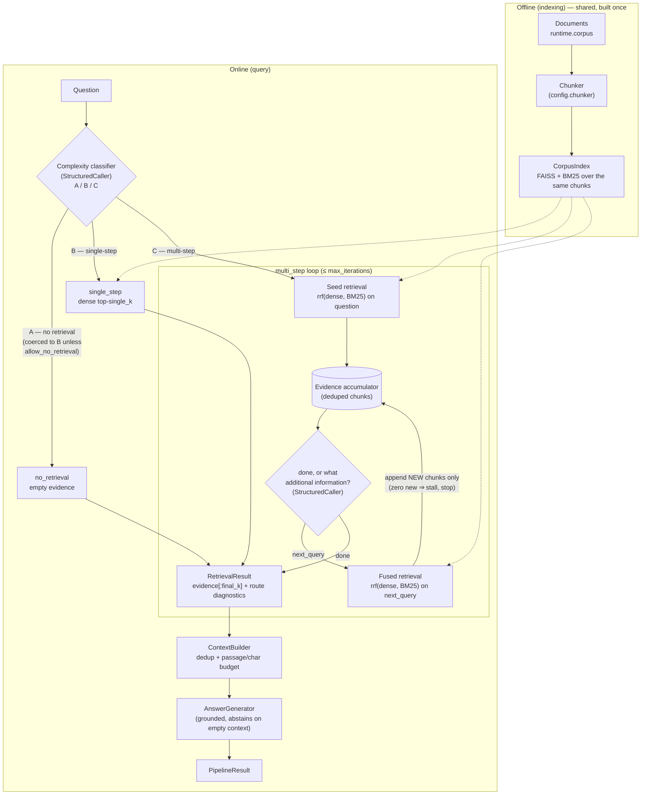

# adaptive — architecture

Complexity-routed retrieval: one cheap classifier call decides, per query, between no retrieval,
a single dense pass, and an iterative fused-retrieval chain. Only the chosen route runs.

## Data flow

## Components

| Component | File | Responsibility |
|---|---|---|
| `AdaptiveConfig` | `config.py` | Routing policy (`allow_no_retrieval`), per-route budgets (`single_k`, `per_iteration_k`, `max_iterations`, `rrf_k`, `final_k`), context budget; frozen |
| `CLASSIFIER_PROMPT` / `FOLLOW_UP_PROMPT` | `prompts.py` | The package's only two LLM touchpoints, both demanding bare JSON |
| `ComplexityClassifier` | `classifier.py` | One structured call → `Classification(label, raw_label, reason, coerced, fallback)`; applies A→B coercion; falls back to C (not B) on unusable output — misrouting hard→cheap loses recall, easy→expensive only loses money |
| `no_retrieval` / `single_step` | `strategies.py` | Route A (empty evidence → generator abstains) and route B (one dense pass, shape-identical to the naive baseline) |
| `MultiStepRetriever` | `strategies.py` | Route C: seed fused retrieval → (decide → follow-up fused retrieval → append new)* with dedup, stall detection, and per-iteration records |
| `AdaptiveRetriever` | `retriever.py` | classify → dispatch → cap evidence at `final_k` → merge classifier + route diagnostics into one `RetrievalResult` |
| `Pipeline` | `pipeline.py` | Contract entrypoints (`retrieve`, `answer`); lazy index build when none injected; spans around every stage |
| `CorpusIndex` (core) | injected | Shared offline artifacts — chunks, embeddings, FAISS + BM25 |

## Trace shape

- Route B: `adaptive.pipeline > adaptive.retrieve > adaptive.classify, adaptive.route.single_step > adaptive.single_step, adaptive.build_context > generate`
- Route C: `adaptive.pipeline > adaptive.retrieve > adaptive.classify, adaptive.route.multi_step > adaptive.multi_step > adaptive.iteration(×n), adaptive.build_context > generate`

## Failure modes

| Failure | Symptom | Why it is structural |
|---|---|---|
| **Router error dominates** | Multi-hop recall collapses while single-hop stays fine; `diagnostics.classifier` shows `B` on 2-hop items | Routes are known quantities; the only novel decision is the label. A C→B misroute puts a multi-hop question on single-shot dense, which cannot fetch the bridge doc — confident recall-zero. The prior, cruder router scored 25% on multi-hop for exactly this reason. B→C misroutes are benign (first decision says "done") but erode the cost advantage |
| **Iterative loop stalls on repeated follow-ups** | `stop_reason: "stalled"` with an unanswered question; last iteration's `new_chunk_ids` empty | When the LLM keeps rephrasing the same gap, fused search keeps returning already-held chunks. Evidence unchanged ⇒ the next decision (temperature 0) would be identical ⇒ livelock. The loop stops on the first zero-new-chunks iteration by design — a truncated chain over an infinite one — but the truncation itself can strand a hop |
| **Cost/latency variance per query** | p50 cheap, p99 expensive; identical questions differ in latency across phrasings | Variance is the price of adaptivity: A/B cost ~1 LLM call, C costs 2 + n calls and n+1 retrievals. Capacity planning must budget for the route *mix*, and a drifting classifier silently shifts that mix |
| **Classifier output failure → forced C** | `classifier.fallback: true`; easy queries taking the expensive route | When structured output is unusable after repair, defaulting cheap would risk recall, so we default to C. Correct but costly — a high fallback rate means the classifier prompt (or model) needs attention, not the routes |
| **`final_k` starves long chains** | `evidence_chunks` ≫ `kept_chunks`; answer misses a late-hop fact | Evidence keeps accumulation order (seed first); the cap drops the newest hops. Raise `final_k`/`context_max_passages` together if 3-hop questions matter |

## Tuning

| Knob | Effect |
|---|---|
| `allow_no_retrieval` | Enables the paper's A route. Keep False on this closed fictional corpus (parametric answers are wrong by construction); consider True only where corpus and world knowledge overlap |
| `single_k` ↑ | Route B recall ↑, precision ↓ — the standard naive trade-off, applied to the traffic majority |
| `per_iteration_k` ↑ | Each hop contributes more candidates: fewer stalls, noisier evidence pool. Small values keep hops surgical |
| `max_iterations` ↑ | Longer chains become reachable; worst-case cost/latency grows linearly. 3 covers 2–3 hop corpora |
| `rrf_k` ↓ | Sharpens fusion toward each ranking's head; ↑ flattens toward consensus. 60 is canonical |
| `final_k` ↑ | More accumulated evidence survives to metrics + context; raise `context_max_passages` with it or truncation eats the gain |
| `evidence_max_chars_per_passage` ↓ | Cheaper decision calls, but the decider sees less of each passage — too low and it issues redundant follow-ups (stall risk ↑) |

## Reference

Jeong, S., Baek, J., Cho, S., Hwang, S. J., & Park, J. C. (2024). *Adaptive-RAG: Learning to
Adapt Retrieval-Augmented Large Language Models through Question Complexity.* NAACL 2024,
arXiv:2403.14403. The paper trains a T5 complexity classifier on silver labels and routes between
no / single-step / multi-step retrieval; this package implements the same three-way routing with
a zero-shot structured LLM classifier and a fused iterative C route, from core primitives only.
