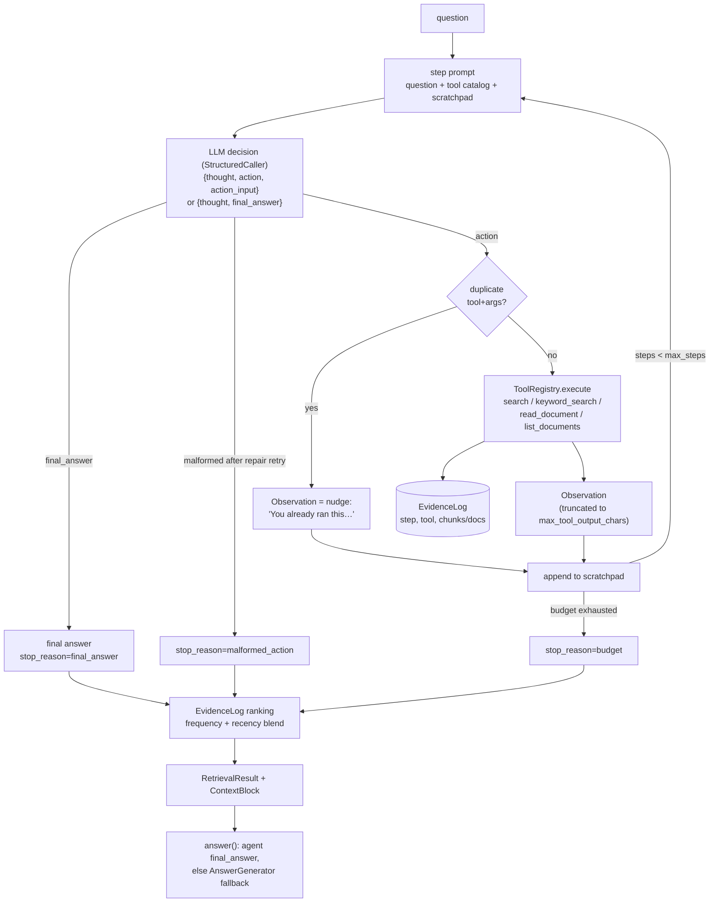

# Agentic RAG — architecture

ReAct-style tool-using retrieval agent (Yao et al. 2023, arXiv:2210.03629) over the shared
`core.CorpusIndex`. No offline artifacts of its own — the only offline work is the injected (or
lazily built) index; everything else happens online, per question.

## Data flow

Whatever way the loop ends, the retrieval output is built from the EvidenceLog — a budget-killed
trajectory still surfaced scoreable evidence.

## Components

| component | file | responsibility |
|---|---|---|
| `Config` | `config.py` | frozen tunables; validated at construction |
| prompts | `prompts.py` | system prompt, step template (`Decide your next action` marker), duplicate nudge |
| `Tool` / `ToolRegistry` | `tools.py` | tool catalog → prompt block; execute with errors-as-observations |
| `EvidenceLog` | `evidence.py` | dedup'd trail of touched chunks/docs; frequency+recency ranking |
| `ReActAgent` / `Trajectory` | `agent.py` | the loop, duplicate guard, truncation, per-step tracer spans |
| `Pipeline` | `pipeline.py` | contract entrypoints, one-run cache, generator fallback |

## The tools

| tool | arguments | what it does | evidence recorded |
|---|---|---|---|
| `search` | `query` | dense semantic search, top `search_k` chunk snippets with chunk + doc ids | every hit chunk |
| `keyword_search` | `query` | BM25 — exact names/terms semantic search blurs | every hit chunk |
| `read_document` | `doc_id` | full document text — the follow-up read after a hit | synthetic whole-doc chunk `{doc_id}::doc` |
| `list_documents` | — | corpus catalog (ids + titles) for orientation | none (catalog only, on purpose — recording all docs would drown the signal) |

All failure modes of the tool layer — unknown tool name, non-dict `action_input`,
missing/unexpected arguments, tool exceptions, unknown `doc_id` — return `Error: ...` strings **as
observations** instead of raising. The agent reads its own mistake in the scratchpad next step and
can self-correct; this is what makes the loop robust to its own malformed calls.

## EvidenceLog mechanics

- Tools record into one shared log; the loop calls `begin_step(i)` before each execution so every
  record carries its step index and tool name.
- Dedup by `chunk_id`: first-seen chunk object is kept; later touches bump `touches` and
  `last_step`.
- Reading a document records a synthetic `Chunk(chunk_id=f"{doc_id}::doc")` holding the full text,
  so whole-doc reads flow through the same `ScoredChunk` provenance as search hits.
- **Ranking = `touches + recency_weight × (last_step+1)/(n_steps+1)`.** Frequency dominates
  (config enforces `recency_weight < 1`, so one extra touch beats any recency bonus): evidence
  surfaced by several independent probes is corroborated — the RRF voting intuition. Recency
  breaks ties toward late-trajectory evidence, because later actions happen *after* the agent has
  read intermediate results and narrowed in — the step-3 `read_document` in a hop chain is nearly
  always the answer-bearing doc. Raw retriever scores are discarded: cosine, BM25 and doc-reads
  are incomparable scales produced by different queries at different steps.
- Docs rank by summed chunk blends; the chunk list is grouped by doc rank so
  `RetrievalResult.doc_ids` reproduces the documented doc ranking exactly.

## Failure modes

| failure | symptom | mitigation here | residual risk |
|---|---|---|---|
| loop stall (query repeat) | same tool+args every step | duplicate detector skips re-execution, injects a change-strategy nudge | model may cycle between *two* queries; budget still bounds it |
| budget exhaustion mid-chain | `stop_reason="budget"`, no final answer | evidence collected so far is still ranked; `answer()` falls back to the shared generator | the bridge doc for the last hop may be missing → wrong/abstained answer |
| malformed actions | invalid JSON / wrong shape | `StructuredCaller` repair-retries once; tool-arg errors return as observations the agent can read | persistent malformed output ends the run (`stop_reason="malformed_action"`) |
| tool-output truncation | long doc clipped at `max_tool_output_chars` | limit is config-tunable; search returns snippets, `read_document` for depth | **the key fact can sit past the cut** — raise the limit for long-document corpora |
| premature finish | answer from too little evidence | system prompt demands grounding in observations; cost pressure is stated explicitly | inherent LLM judgment call; benchmark catches it as an accuracy miss |
| trajectory non-determinism | same question, different cost/steps across runs | temperature-0 defaults in core runtime; per-question run cache keeps retrieve/answer coherent | real sampled LLMs still vary; cost is a distribution, not a number |

## Tuning

| knob | default | raise it when… | lower it when… |
|---|---|---|---|
| `max_steps` | 8 | deeper hop chains / larger corpora | cost-bound; questions are mostly single-hop |
| `search_k` / `keyword_k` | 5 | recall matters more than scratchpad noise | observations drown the model in weak hits |
| `max_tool_output_chars` | 2000 | documents are long and the key fact gets truncated | prompt growth (cost) hurts |
| `final_k` | 8 | benchmark k is larger; evidence pool is rich | precision of the context matters most |
| `recency_weight` | 0.9 | late reads should win ties more aggressively (multi-hop) | early broad hits deserve equal footing (0 = pure frequency) |
| `cache_size` | 16 | interactive sessions revisit questions | memory-sensitive; benchmark only needs 1 |
| `max_decision_tokens` | 512 | thoughts get truncated mid-JSON | never much — cheap insurance |

## References

- Yao, S., Zhao, J., Yu, D., Du, N., Shafran, I., Narasimhan, K., Cao, Y. (2023). *ReAct:
  Synergizing Reasoning and Acting in Language Models.* ICLR 2023. arXiv:2210.03629.
- Cormack, G. V., Clarke, C. L. A., Büttcher, S. (2009). *Reciprocal Rank Fusion outperforms
  Condorcet and individual rank learning methods.* SIGIR 2009 — the voting intuition behind the
  evidence-frequency ranking.
