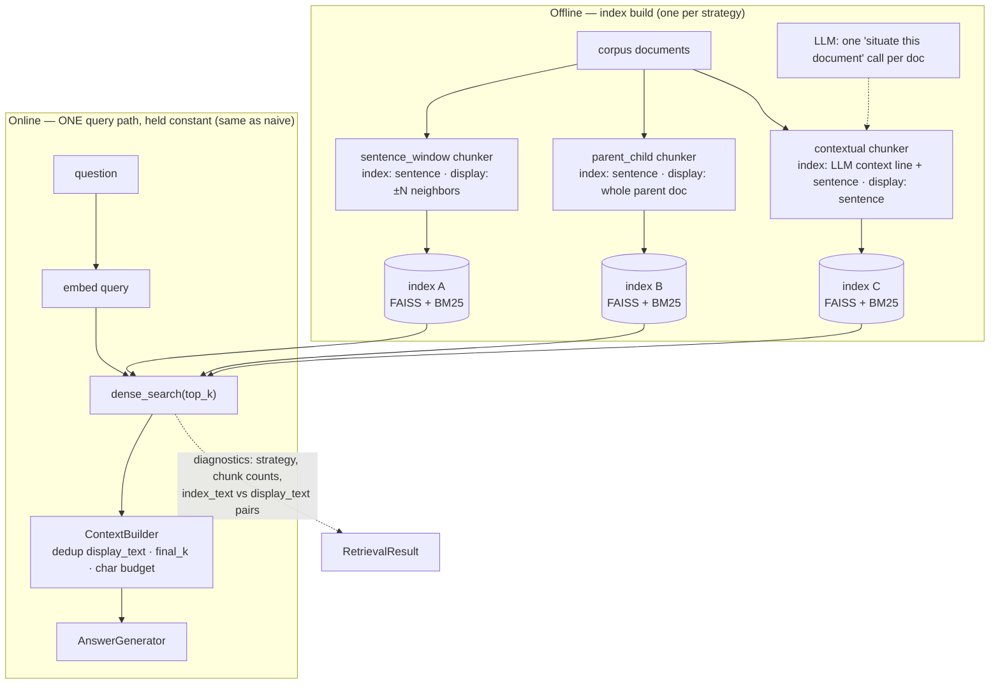

# Architecture: chunking-strategy RAG

## Thesis

Retrieval quality is often decided at **index time**, not query time. Most RAG work tunes the
online path (fusion, reranking, query rewriting) while treating the index as given — yet the same
dense retriever over the same corpus swings materially with the chunking strategy that built the
index. This package makes that claim testable: **one** query path (plain dense retrieval,
byte-for-byte the same logic as naive RAG — that is the controlled variable) fanned across
**multiple** index variants. Every score delta between pipelines is attributable to chunking
alone.

## Data flow

The benchmark builds the three indexes once (sharing one embedder and one LLM), then instantiates
`Pipeline(runtime, index=idx, strategy=name)` per variant and runs identical queries through the
identical online path.

## Components

| Component | File | Responsibility |
|---|---|---|
| `Config` | `config.py` | Frozen tunables; query-path knobs uniform across strategies, build knobs per strategy |
| `StrategyProfile` / `STRATEGY_PROFILES` | `strategies.py` | Design cards for all six core strategies; import-time drift check against `CHUNKER_REGISTRY` |
| `DenseStrategyRetriever` | `retriever.py` | Dense top-k over one strategy's index + match-vs-display diagnostics |
| `Pipeline` | `pipeline.py` | Lazy/injected index, `retrieve()` for the benchmark, `answer()` standalone |

## Strategy comparison

The seam is `Chunk.index_text` (matched) vs `Chunk.display_text` (returned). Benchmarked
strategies in **bold**; the rest are the coupled baselines they react to.

| Strategy | Index text | Display text | Tradeoff |
|---|---|---|---|
| `whole` | entire document | entire document | no precision, max context — one vector averages every topic in the doc |
| `sentence` | one sentence | same sentence | max precision, starved context — the generator gets a fragment |
| `fixed` | ~800-char window + overlap | same window | the industry-default compromise; one size still serves both masters |
| **`sentence_window`** | one sentence | sentence ± N neighbors | precise match, paragraph context; cheap decoupling |
| **`parent_child`** | one sentence (child) | whole parent document | precise match, whole-doc context; pays in prompt tokens |
| **`contextual`** | LLM doc-context line + sentence | bare sentence | sharpens the *match* itself; pays one LLM call per doc at build |

When each wins / loses (full prose in `STRATEGY_PROFILES`):

- `sentence_window` wins when evidence spans a few adjacent sentences; loses when the needed
  context lives outside the window.
- `parent_child` wins on synthesis questions needing whole-doc context (dedup collapses many
  child hits into one passage); loses under tight token budgets.
- `contextual` wins on corpora of similar entities where bare sentences are ambiguous across
  documents; loses when the generated prefix is wrong or generic.

## Failure modes

| Failure | Mechanism | Mitigation |
|---|---|---|
| **Contextual prefix poisoning** | The build-time LLM writes a wrong/generic context line, and it is stamped into the index text of *every* chunk of that document — one bad completion corrupts a whole doc's retrievability at once | Cache + audit the per-doc context lines (they are in chunk `metadata["context"]`); keep the prompt narrow; rebuild is one LLM call per doc |
| **Parent-child token inflation** | Every hit's display text is a full document; two long parents can eat the entire `max_context_chars` budget and evict every other source (`context_truncated: true` in diagnostics) | Raise `top_k` relative to `final_k` (dedup absorbs sibling hits), cap parent length upstream, or fall back to `sentence_window` |
| **Sentence-only context starvation** | Coupled sentence chunks match perfectly but hand the generator a fragment without antecedents — the strict grounded generator then abstains ("retrieval failure" that is really a *display* failure) | This is precisely what the decoupled strategies fix; check diagnostics `expansion == 1.0` with high abstain rate as the signature |
| **Window too wide** | `sentence_window_size` grown until display texts approach whole docs — parent_child costs without its whole-doc guarantee | Keep N ∈ {1..3}; if you need more, switch strategy deliberately |
| **Mislabeled comparison** | An injected index built by strategy X run under a pipeline labeled Y would silently corrupt the benchmark | `Pipeline.__init__` raises `ConfigurationError` on index/strategy mismatch |

## Tuning guide

1. **Start with the diagnostics, not the knobs.** `matches[*].index_text` vs `display_text` and
   `expansion` tell you whether matching or reading is the bottleneck; `context_truncated` tells
   you the budget is the bottleneck.
2. `top_k` (8) vs `final_k` (5): keep `top_k` comfortably larger — display-text dedup (especially
   parent_child, where all children of a doc share one display text) collapses hits, and the gap
   is your refill buffer.
3. `max_context_chars` (6000): the knob that prices parent_child. Shrink it and parent_child
   degrades first; that ordering is itself a useful diagnostic.
4. `sentence_window_size` (1): raise to 2–3 only if answers demonstrably span farther than one
   neighbor; each step trades precision-budget for context.
5. `fixed_max_chars` / `fixed_overlap_chars` (800/120): only relevant if you benchmark the
   `fixed` baseline; overlap below ~1 sentence reintroduces boundary-split evidence.
6. Changing embedder or generator? Rebuild **all** strategy indexes together — comparisons are
   only honest when every offline artifact shares the same wiring (the benchmark injects indexes
   for exactly this reason).

## Citations & lineage

- **Anthropic, "Introducing Contextual Retrieval" (Sept 2024)** — the `contextual` strategy:
  prepend chunk-situating context before embedding/BM25-indexing; reported up to 49% reduction in
  retrieval failure rate (67% with reranking). https://www.anthropic.com/news/contextual-retrieval
- **LlamaIndex Sentence-Window retrieval** (`SentenceWindowNodeParser` +
  `MetadataReplacementPostProcessor`) — the `sentence_window` strategy's lineage: embed single
  sentences, swap in the surrounding window at synthesis time.
- **LlamaIndex Auto-Merging / hierarchical retrieval & LangChain `ParentDocumentRetriever`** —
  the small-to-big lineage of `parent_child`: retrieve leaf chunks, return their parent.
- **Lewis et al., "Retrieval-Augmented Generation for Knowledge-Intensive NLP Tasks" (NeurIPS
  2020)** — the base RAG formulation whose index-construction step this package treats as the
  experimental variable.
