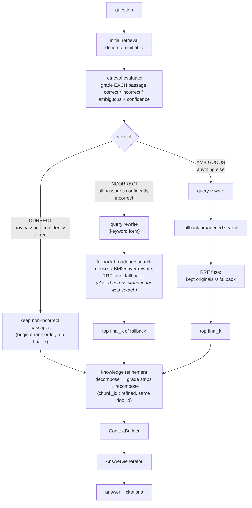

# Corrective RAG — architecture

Paper: Shi-Qi Yan, Jia-Chen Gu, Yun Zhu, Zhen-Hua Ling, *Corrective Retrieval Augmented
Generation*, 2024 ([arXiv:2401.15884](https://arxiv.org/abs/2401.15884)).

## Control flow

Everything is online (query time); the only offline artifact is the shared `CorpusIndex`
(injected by the benchmark or built lazily from `runtime.corpus`).

Trace of one query: `corrective.pipeline > corrective.retrieve > corrective.initial_search >
corrective.evaluate > [corrective.rewrite > corrective.fallback_search] > corrective.refine >
generate`.

## Components

| Component | File | LLM calls | Role |
|---|---|---|---|
| `Config` | `config.py` | — | Frozen, validated tunables; the only place knobs live. |
| Prompts | `prompts.py` | — | Grade / strip-relevance / rewrite templates. |
| `RetrievalEvaluator` | `evaluator.py` | 1 structured call **per passage** | Grades each passage `{grade, confidence}` via `StructuredCaller`; aggregates to CORRECT / INCORRECT / AMBIGUOUS. Unparseable grade degrades to `("ambiguous", 0.0)`. |
| `QueryRewriter` | `rewriter.py` | 1 plain call | Keyword rewrite for the fallback; quote-stripped, falls back to the original question. |
| Fallback search | `retriever.py` | — | Dense ∪ BM25 over the rewrite, `core.rrf`-fused at `fallback_k` — the web-search stand-in. |
| `KnowledgeRefiner` | `refiner.py` | 1 YES/NO call **per strip** | Decompose-then-recompose: `split_sentences` → keep relevant strips in order → synthesize `::refined` chunks. Skipped below `refine_min_passages`; single-strip passages kept free. |
| `CorrectiveRetriever` | `retriever.py` | — | Orchestration + diagnostics (grades, verdict, action, rewrite, strip counts). |
| `Pipeline` | `pipeline.py` | 1 answer call | Package contract: `retrieve()` / `answer()`, injectable index, lazy build. |

## Failure modes

| Failure | Mechanism | Mitigation here |
|---|---|---|
| **Evaluator miscalibration flips the branch** | The verdict is only as good as the grader. False "correct" (confident) → a bad retrieval is *trusted* and refined instead of corrected; false "incorrect" across the board → a good retrieval is *discarded* for a noisier fallback. Every downstream step amplifies the wrong branch. | Confidence thresholds gate both extreme verdicts; everything uncertain lands in AMBIGUOUS, which keeps *both* sources. Unparseable grades degrade to ambiguous/0.0, never to a confident branch. |
| **Strip-grading cost** | Refinement costs ~(passages × strips) LLM calls per query — the dominant cost at scale (`final_k=5` × ~3 strips ≈ 15 calls on top of `initial_k` grading calls). | `refine_strips` master switch; `refine_min_passages` skips small selections; single-strip passages are kept without a call; strip grader is a minimal YES/NO completion, not JSON. |
| **Rewrite can't invent unseen vocabulary** | The fallback query is generated *from the question*. A bridge document sharing no vocabulary with the question (multi-hop) is unreachable no matter how many rewrite loops run — rephrasing explores the neighborhood of the question, not the corpus. | None by design — this is the architecture's honest ceiling (0% multi-hop in the last run). Structural/iterative retrieval (GraphRAG, RAPTOR, agentic) is the fix, not more rewriting. |
| **Over-aggressive strip filter empties the context** | A miscalibrated strip grader can drop every strip of every passage. | Refiner safety valve: if nothing survives, the unrefined passages are returned and the refinement report says so. |
| **Empty initial retrieval** | Nothing to grade. | Aggregation defines empty → INCORRECT, which routes straight to the fallback sweep. |

## Tuning

| Knob | Default | Raise it when… | Lower it when… |
|---|---|---|---|
| `initial_k` | 8 | The evaluator has budget and recall is the bottleneck (more graded candidates). | Grading cost dominates (one LLM call per passage). |
| `correct_confidence` | 0.7 | The grader over-trusts weak hits (too many CORRECT verdicts). | Too many easy queries fall into AMBIGUOUS and pay for fallback. |
| `incorrect_confidence` | 0.7 | Good retrievals get discarded (too many INCORRECT verdicts). | Bad retrievals keep sneaking into COMBINE instead of being replaced. |
| `fallback_k` | 12 | The corpus is large and the fallback needs a wider net. | Fallback noise is drowning the RRF fusion. |
| `final_k` | 5 | Answers miss supporting facts. | Context dilution / strip-grading cost. |
| `refine_strips` / `refine_min_passages` | on / 2 | Distractor sentences are leaking into answers (strengthen filtering: keep on, lower the skip threshold). | Latency/cost budget is tight — turn refinement off; you get plain graded CRAG. |
| `rrf_k` | 60 | Keep at 60 (canonical) unless one ranking should dominate fusion (lower = head-heavier). | — |
| `chunker` | `fixed` | — use multi-sentence chunks; a `sentence` index gives one strip per passage and makes refinement a no-op. | — |

## Contract

`corrective.Config` (frozen dataclass) and `corrective.Pipeline` with
`Pipeline(runtime, config=None, *, index=None)`, `retrieve(question) ->
tuple[RetrievalResult, ContextBlock]`, `answer(question) -> PipelineResult`. Imports from
`core` only; runs offline under `Runtime.for_testing()` with `FakeLLM` rules on the prompt
marker phrases `"Grade the retrieved passage"`, `"Is this strip relevant"`,
`"Rewrite the question"`.
