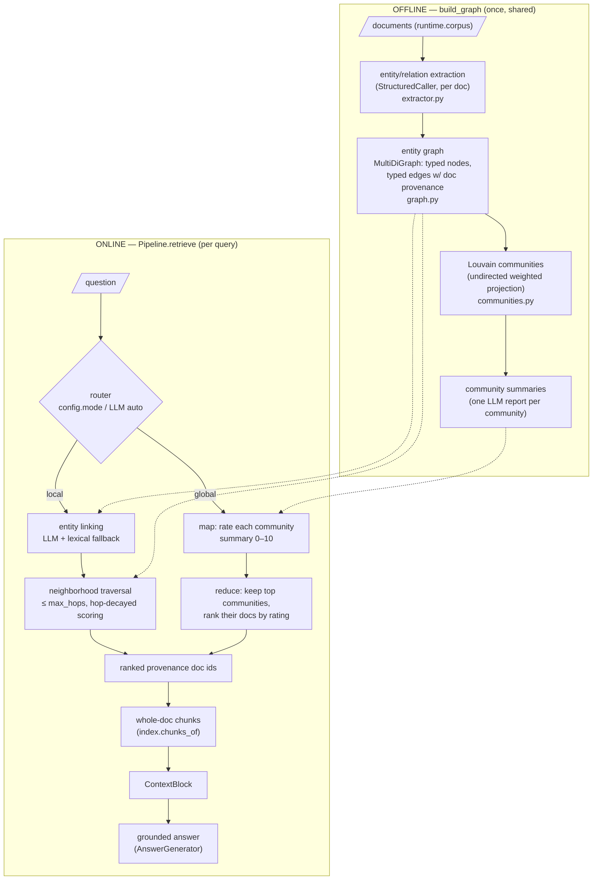

# GraphRAG: architecture

Implementation of Edge et al. 2024, *"From Local to Global: A Graph RAG Approach to Query-Focused
Summarization"* (arXiv:2404.16130), on the shared `core` framework. One flat Louvain partition
stands in for the paper's Leiden hierarchy, at 14 documents there is not enough graph for
multiple community levels to differ.

## Data flow

## Components

| Component | File | Stage | Responsibility |
|---|---|---|---|
| `Config` | `config.py` | both | Frozen tunables; validates mode/hops/top-k at construction |
| prompts | `prompts.py` | both | All five LLM touchpoints, each with a stable marker phrase |
| `EntityRelationExtractor` | `extractor.py` | offline | One structured call per doc; validator normalizes names, coerces types, drops dangling relations |
| `KnowledgeGraph` / `build_graph` | `graph.py` | offline | Merge extractions across docs (name-normalized), entity→docs inverted index, stats |
| `build_communities` | `communities.py` | offline | Louvain on the undirected weighted projection (seeded), LLM report per community ≥ min size |
| `LocalSearch` | `local_search.py` | online | LLM + lexical entity linking, BFS ≤ `max_hops`, hop-decayed doc scoring, path strings |
| `GlobalSearch` | `global_search.py` | online | Map (rate summaries 0 to 10) → reduce (top `max_communities`, docs ranked by summed rating) |
| `GraphRetriever` | `retriever.py` | online | Route, run search, resolve doc ids → `ScoredChunk`s, assemble diagnostics |
| `Pipeline` | `pipeline.py` | online | Framework contract; lazy `graph`/`index`; context + generation |

Every stage runs inside a tracer span (`graphrag.build_graph` → `graphrag.extract` →
`graphrag.communities`; `graphrag.pipeline.retrieve` → `graphrag.retrieve` →
`graphrag.local_search` / `graphrag.global_search` → `graphrag.rate_community`).

## Diagnostics contract

`RetrievalResult.diagnostics` carries the retrieval story: `mode`, `router` (configured /
selected / decided_by), `graph` stats, and per mode, local: `matched_entities`,
`entity_linking` (llm vs lexical), `traversal_paths` (`"A -[rel]-> B"`), `entity_hops`,
`doc_scores`, `seeded`; global: `community_ratings`, `communities_consulted`, `doc_scores`.

## Failure modes

| Failure | Mechanism | Symptom | Mitigation |
|---|---|---|---|
| **Missed extraction breaks paths** | An entity/relation the extractor skips does not exist in the graph; every traversal through it is silently gone | Multi-hop questions retrieve the seed's docs but never the bridge doc | Better extraction prompt/model; multiple extraction passes (paper's "gleanings"); it cannot be fixed at query time |
| **Entity-name aliasing splits nodes** | "Veyra" vs "Veyra Systems" normalize to different keys → two nodes sharing no edges | Traversal reaches half the entity's neighborhood; doc votes split | Casefold + whitespace normalization (done); containment matching at link time (done); real systems add embedding/alias resolution |
| **Hop-limit truncation** | A k-hop chain with k > `max_hops` never reaches the far entity | 3-hop questions score 0 even though every edge exists | Raise `max_hops` (precision cost), or route such questions to iterative/agentic retrieval |
| **Query entities miss the graph** | LLM linker extracts an entity that resolves to no node and lexical fallback finds nothing | Empty local result (`seeded: false` in diagnostics) | Auto mode routes broad questions to global search; fallback merge keeps recall up |
| **Community summary too coarse** | A 0 to 10 rating of a 3-sentence summary is a lossy relevance proxy | Global search keeps a thematically-close but answer-free community | More/smaller communities (`min_community_size`), richer summaries, higher `min_community_rating` |

## Tuning

| Knob | Default | Raise it when… | Cost |
|---|---|---|---|
| `mode` | `"local"` | Workload mixes entity and corpus-level questions → `"auto"` | +1 router call per query |
| `max_hops` | 2 | Gold chains are longer than 2 relations | Precision: each hop lets more of the corpus vote |
| `top_k_docs` | 5 | Bridge docs rank just below the cut | Context dilution |
| `entity_match_min_chars` | 4 | Short entity names cause false lexical matches | Too high → fallback stops matching real short names |
| `max_communities` | 3 | Corpus has many distinct themes | More docs per global answer, less focus |
| `min_community_rating` | 1 | Global answers cite irrelevant clusters | Recall on borderline communities |
| `min_community_size` | 2 |, lower to 1 to summarize singletons too | One extra summary call per singleton |
| `louvain_seed` | 42 | Never (reproducibility) |, |

## Citation

Edge, D., Trinh, H., Cheng, N., Bradley, J., Chao, A., Mody, A., Truitt, S., Metropolitansky, D.,
Ness, R. O., & Larson, J. (2024). *From Local to Global: A Graph RAG Approach to Query-Focused
Summarization.* arXiv:2404.16130.
