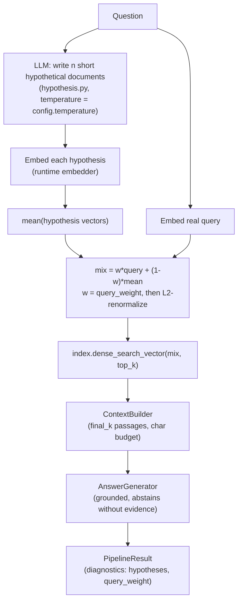

# HyDE — architecture

Citation: Gao, Ma, Lin, Callan (2022). *Precise Zero-Shot Dense Retrieval without Relevance
Labels.* [arXiv:2212.10496](https://arxiv.org/abs/2212.10496).

## Data flow

Offline: the shared `CorpusIndex` (chunk → embed → FAISS/NumPy + BM25) is built once by
`Runtime.build_index(config.chunker)` or injected by the benchmark. Everything below is the
online path — note the extra LLM call sits **on the critical path** before any retrieval happens.

## Components

| Component | File | Responsibility |
|---|---|---|
| `Config` | `config.py` | Frozen tunables; validates ranges and rejects `n_hypotheses > 1` at `temperature == 0` (identical hypotheses = wasted calls). |
| Hypothesis prompt | `prompts.py` | The one LLM touchpoint. Contains the phrase "hypothetical document" so `FakeLLM.on()` rules route it. Explicitly permits invented facts. |
| `generate_hypotheses` | `hypothesis.py` | n independent `llm.complete` calls → `list[str]`; drops empty completions; traced (`hyde.hypotheses`). |
| `build_search_vector` | `retriever.py` | `l2_normalize(w·q + (1−w)·mean(hyps))`; falls back to the plain query vector when no hypotheses survive. |
| `retrieve` | `retriever.py` | `dense_search_vector(mix, top_k)` → `RetrievalResult`; diagnostics carry `hypotheses`, `query_weight`, fallback flag; traced (`hyde.retrieve`). |
| `Pipeline` | `pipeline.py` | Contract entrypoints: `retrieve()` (benchmark path) and `answer()` (adds `core.AnswerGenerator`); lazy or injected index; traced (`hyde.pipeline`). |

## Failure modes

| Failure | Mechanism | Mitigation |
|---|---|---|
| **Hallucinated entities steer retrieval off-corpus** | The hypothesis is allowed to invent names/dates; at low `query_weight` those inventions dominate the probe and pull hits toward whatever resembles the hallucination, not the question. | Raise `query_weight` (the real query anchors the mix); read `diagnostics["hypotheses"]` first when a HyDE run retrieves nonsense — the drift is always visible there. |
| **Multi-hop: 0% in this repo's benchmark** | A hypothetical answer paragraph cannot resemble a *bridge* document that shares no vocabulary with the question. One embedding probe = one hop; HyDE fixes vocabulary mismatch, not structural hops. | Use iterative/structural architectures (`agentic`, `raptor`) for multi-hop; HyDE is the wrong tool. |
| **Extra LLM call on the critical path** | Latency and cost of one (or n) generation calls are paid *before* retrieval even starts — per query, unlike offline enrichment (e.g. contextual chunking). | Keep `hypothesis_max_tokens` small; keep `n_hypotheses = 1` unless recall measurably improves; cache completions (`CachingLLM`) for repeated queries. |
| **Empty/garbage hypothesis** | A refusing or malformed LLM would otherwise embed noise. | Empty completions are dropped; with zero hypotheses the retriever degrades to naive dense search and sets `used_query_fallback` in diagnostics. |

## Tuning

| Knob | Low | High | Guidance |
|---|---|---|---|
| `n_hypotheses` | 1 (default): cheapest, deterministic at temp 0 | 3–5: averages out per-draft quirks, better recall on ambiguous questions | Only useful with `temperature > 0` — otherwise every draft is identical (Config enforces this). Cost scales linearly. |
| `temperature` | 0.0 (default): reproducible benchmarks | 0.7–1.0: diverse drafts for multi-hypothesis runs | Raise together with `n_hypotheses`; a single high-temperature hypothesis just adds variance. |
| `query_weight` | 0.0: paper-pure HyDE, max vocabulary transfer, max hallucination drift | 1.0: naive dense retrieval, HyDE disabled | 0.25 default. Push up when the corpus is entity-dense (drift hurts most); push down when questions are terse/jargon-mismatched (vocabulary transfer helps most). |
| `top_k` / `final_k` | tight: precision | wide: recall for the generator to sift | Standard retrieval dial; `final_k` also bounds generator context cost. |

## Trace spans

`hyde.pipeline` → `hyde.hypotheses` (n, temperature, generated) → `hyde.retrieve` (top_k,
hypotheses, query_weight, chunks) → core `generate`.
