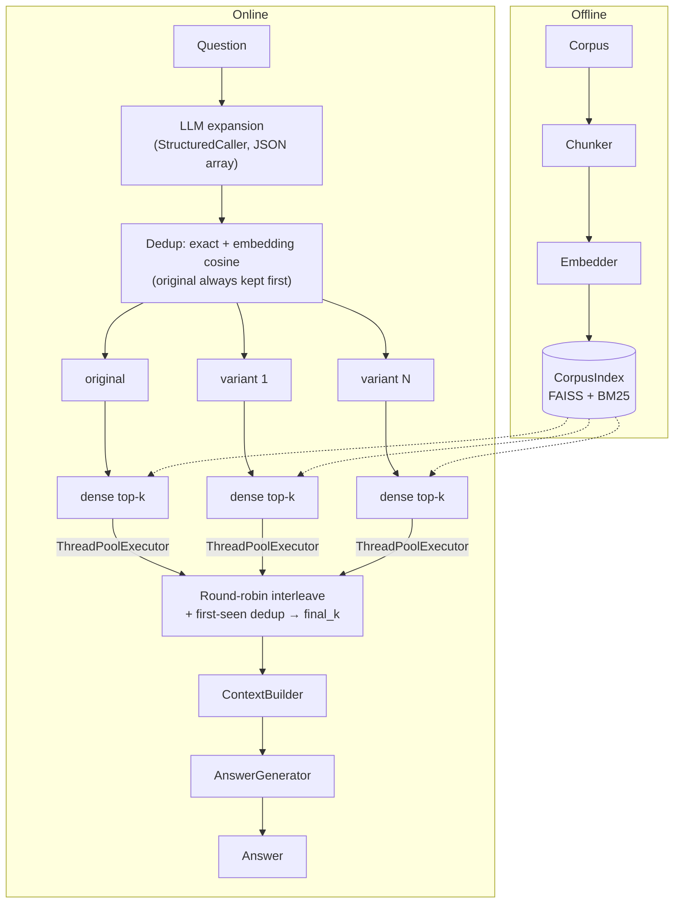

# multi_query — architecture

## Data flow

## Components

| Component | File | Responsibility |
|---|---|---|
| `Config` | `config.py` | Frozen tunables; the only source of numbers |
| `EXPANSION_PROMPT` | `prompts.py` | Sole LLM prompt; marker phrase "alternative phrasings" for test routing |
| `validate_query_list` | `expander.py` | Structured-output validator: `list[str]`, strip, drop empties/exact dupes |
| `QueryExpander` | `expander.py` | LLM call via `StructuredCaller`, semantic dedup, graceful fallback |
| `retrieve_per_query` | `retriever.py` | Concurrent per-variant dense search (I/O parallelism) |
| `interleave` | `retriever.py` | Round-robin union merge, first-seen chunk dedup |
| `Pipeline` | `pipeline.py` | Composition, spans, diagnostics, `retrieve`/`answer` contract |

Core services used: `StructuredCaller`, `CorpusIndex.dense_search`, `ContextBuilder`,
`AnswerGenerator`, `Tracer` spans (`multi_query.pipeline > multi_query.retrieve >
multi_query.expand / multi_query.fanout`).

## Failure modes

| Failure | Symptom | Mitigation here |
|---|---|---|
| **Expansion drift** | Variants wander off-intent; off-topic chunks crowd the pool | Prompt pins intent ("add no new constraints, drop none"); original question always searched and ranked first in the interleave; `final_k` caps damage |
| **Redundant variants** | N searches retrieve one neighborhood — pure cost, no recall | Exact dedup in validator + cosine dedup at `dedup_threshold` |
| **Malformed LLM output** | JSON parse/shape failure | `StructuredCaller` repair-retry; then graceful fallback to the original question (`expansion_fallback: true` in diagnostics) |
| **Multi-hop bridge docs** | 0% on multi-hop in this repo's benchmark | Not fixable by rephrasing — see README; use agentic/RAPTOR/graph architectures |
| **Cost/latency** | 1 LLM call + (N+1)× retrieval per question | Threaded fan-out hides retrieval latency; tune `n_queries` down |

## Tuning

| Knob | Default | Raise when | Lower when |
|---|---|---|---|
| `n_queries` | 3 | Corpus vocabulary is far from user vocabulary | Cost/latency dominate; variants are redundant |
| `per_query_k` | 8 | Interleave starves variants (final_k ≈ per-variant heads) | Index is small; tails are noise |
| `final_k` | 8 | Downstream reranker/long-context generator | Context budget is tight |
| `dedup_threshold` | 0.92 | Too many good variants dropped | Variants retrieve identical neighborhoods |
| `max_workers` | 4 | Remote store with high RTT | Local index (parallelism buys nothing) |
| `chunker` | sentence | — | — |

## Citations

- LangChain `MultiQueryRetriever` — the lineage of this pattern
  (https://python.langchain.com/docs/how_to/MultiQueryRetriever/).
- Compare: Rackauckas, Z. (2024). *RAG-Fusion: a New Take on Retrieval-Augmented Generation* —
  the consensus-scored sibling implemented in `rag_fusion/`.
