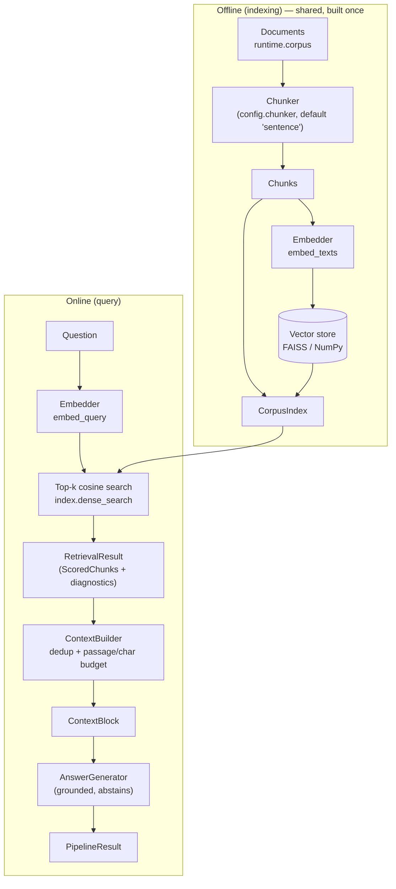

# naive — architecture

Single-shot dense retrieval, no online decisions. This is the reference data flow that every
other package in the repo elaborates on.

## Data flow

## Components

| Component | File | Responsibility |
|---|---|---|
| `NaiveConfig` | `config.py` | The four tunables (chunker, top_k, context budget); frozen so a benchmark run's settings are immutable facts |
| `DenseRetriever` | `retriever.py` | Online half only: one `embed_query` + one ANN lookup; writes per-hit scores and latency into `diagnostics` |
| `Pipeline` | `pipeline.py` | Wires retriever → `ContextBuilder` → `AnswerGenerator`; lazy index build when none injected; spans around every stage |
| `CorpusIndex` (core) | injected | All offline artifacts — chunks, embeddings, vector store — shared across architectures |

## Trace shape

`naive.pipeline > naive.retrieve > naive.dense_search, naive.build_context > generate`

## Failure modes

| Failure | Symptom in the benchmark | Why it is structural |
|---|---|---|
| Multi-hop questions | recall ≈ 0 on 2-hop items even at large k | One query vector points at one region of embedding space; the bridge fact needed to *form* the second query is never retrieved |
| Precision decay with k | answer correctness falls while recall rises as `top_k` grows | Every extra neighbor is topically-similar noise; the grounded generator gets more distractors |
| Exact-string blindness | misses on rare entities / IDs / codes | Embeddings encode meaning, not surface forms; two different serial numbers can be near-identical vectors (see `sparse/`) |
| Query/corpus register gap | flat, low score distribution in `diagnostics["scores"]` | Question-style text embeds far from assertion-style chunks; HyDE/multi-query exist for this |

## Tuning

| Knob | Effect |
|---|---|
| `top_k` ↑ | Recall ↑, precision ↓, context cost ↑. The central naive trade-off — there is no free k |
| `chunker` | Granularity of the match unit. `sentence` = precise but context-poor hits; window/parent-child chunkers trade precision for richer display text |
| `context_max_passages` | How much of the retrieval the generator actually sees; keep = `top_k` so retrieval metrics and generation input coincide |
| `context_max_chars` | Safety budget against oversized chunks; if `diagnostics["context_truncated"]` is true, this (not retrieval) is eating your recall |

## Reference

Lewis et al., *Retrieval-Augmented Generation for Knowledge-Intensive NLP Tasks*, NeurIPS 2020 —
the retrieve-then-generate loop this package implements in its simplest form.
