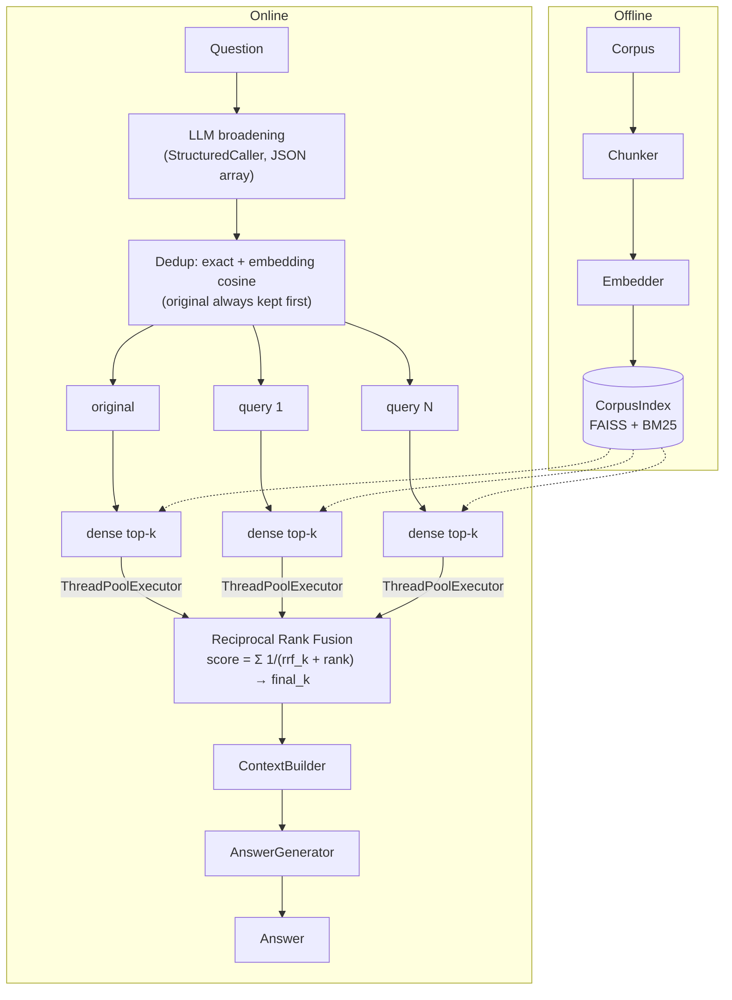

# rag_fusion: architecture

## Data flow

## Components

| Component | File | Responsibility |
|---|---|---|
| `Config` | `config.py` | Frozen tunables; the only source of numbers (incl. `rrf_k`) |
| `EXPANSION_PROMPT` | `prompts.py` | Sole LLM prompt; marker phrase "broaden and diversify" for test routing |
| `validate_query_list` | `expander.py` | Structured-output validator: `list[str]`, strip, drop empties/exact dupes |
| `QueryExpander` | `expander.py` | LLM call via `StructuredCaller`, semantic dedup, graceful fallback |
| `retrieve_per_query` | `retriever.py` | Concurrent per-query dense search (I/O parallelism) |
| `fuse` | `retriever.py` | RRF via `core.retrieval.fusion.rrf`, traced |
| `Pipeline` | `pipeline.py` | Composition, spans, diagnostics, `retrieve`/`answer` contract |

Core services used: `StructuredCaller`, `CorpusIndex.dense_search`, `rrf`, `ContextBuilder`,
`AnswerGenerator`, `Tracer` spans (`rag_fusion.pipeline > rag_fusion.retrieve >
rag_fusion.expand / rag_fusion.fanout / rag_fusion.fuse`).

## Failure modes

| Failure | Symptom | Mitigation here |
|---|---|---|
| **Expansion drift** | Broadened queries wander off-intent and vote for off-topic chunks | Prompt pins intent ("no topic drift"); original question always contributes a ranking; RRF damps any single ranking via `rrf_k` |
| **Duplicate queries double-vote** | Near-identical rankings inflate RRF scores of one neighborhood | Exact dedup in validator + cosine dedup at `dedup_threshold` |
| **Consensus outvotes the specialist** | The one correct doc found by only one query falls below `final_k` | Lower `rrf_k` (sharpen heads) or raise `final_k` |
| **Malformed LLM output** | JSON parse/shape failure | `StructuredCaller` repair-retry; then graceful fallback to the original question (`expansion_fallback: true` in diagnostics) |
| **Multi-hop bridge docs** | 0% on multi-hop in this repo's benchmark | Not fixable by broadening, see README; use agentic/RAPTOR/graph architectures |
| **Cost/latency** | 1 LLM call + (N+1)× retrieval per question | Threaded fan-out hides retrieval latency; tune `n_queries` down |

## Tuning

| Knob | Default | Raise when | Lower when |
|---|---|---|---|
| `n_queries` | 3 | Question is broad/faceted; corpus vocabulary diverse | Cost/latency dominate; queries are redundant |
| `per_query_k` | 8 | Fused pool too shallow for consensus to matter | Index is small; tails are noise |
| `rrf_k` | 60 | Trust consensus more (flatten head influence) | Trust each query's top hits more |
| `final_k` | 8 | Downstream reranker/long-context generator | Context budget is tight |
| `dedup_threshold` | 0.92 | Too many good queries dropped | Rankings look near-identical (double voting) |
| `max_workers` | 4 | Remote store with high RTT | Local index (parallelism buys nothing) |
| `chunker` | sentence |, |, |

## Citations

- Rackauckas, Z. (2024). *RAG-Fusion: a New Take on Retrieval-Augmented Generation.* IJNLC 13(1).
  arXiv:2402.03367.
- Cormack, G. V., Clarke, C. L. A., & Buettcher, S. (2009). *Reciprocal Rank Fusion outperforms
  Condorcet and individual rank learning methods.* SIGIR '09.
- Compare: LangChain `MultiQueryRetriever` lineage, the diversity-merge sibling implemented in
  `multi_query/`.
