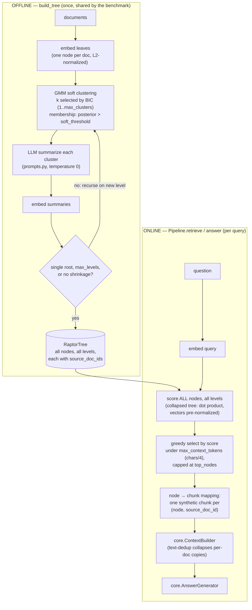

# RAPTOR — architecture

Paper: **Sarthi, Abdullah, Tuli, Khanna, Goldie, Manning — "RAPTOR: Recursive Abstractive
Processing for Tree-Organized Retrieval", ICLR 2024, arXiv:2401.18059.**

## Data flow

## Components

| Component | File | Responsibility | Key decision |
|---|---|---|---|
| `Config` | `config.py` | All tunables, frozen | Immutable/hashable so the benchmark can share one config between builder and pipelines |
| `RaptorNode` / `RaptorTree` | `tree.py` | Offline artifact | Every node stores `source_doc_ids` (leaf provenance union) — the multi-doc credit mechanism |
| `build_tree` | `tree.py` | Offline construction | Leaves = documents (corpus passages are already chunk-sized); forces a single root cluster when a level stops shrinking, so construction always terminates |
| `cluster_level` | `clustering.py` | Soft GMM per level | BIC-selected k; soft membership (posterior > 0.1); **no UMAP** at this corpus scale (documented departure); spherical covariance for tiny-n/high-d |
| `summarize_cluster` | `summarizer.py` | Abstraction step | Temperature 0; prompt demands entity/relationship preservation because summaries replace their members in upper-level search |
| `CollapsedTreeRetriever` | `retriever.py` | Online scoring + contract mapping | Collapsed tree (paper's better variant); one synthetic chunk per (node, source doc) so `RetrievalResult.doc_ids` yields full multi-doc credit while ContextBuilder's dedup keeps context clean |
| `Pipeline` | `pipeline.py` | Contract surface | Tree injected by benchmark or built lazily from `runtime.corpus`; spans wrap every stage |

## Failure modes

| Failure | Mechanism | Symptom / mitigation |
|---|---|---|
| **Summary hallucination propagates upward** | A level-1 summary that invents or garbles a fact becomes *input* to level 2 — errors compound with height, and a hallucinated summary node can outrank truthful leaves | Keep `max_levels` low on small corpora; the prompt forbids unsupported statements; inspect `selected_nodes` diagnostics when answers cite summaries |
| **BIC picks degenerate k on tiny corpora** | With few nodes and high-dim embeddings the BIC parameter penalty can crush the likelihood term, collapsing every level to k=1 (tree = leaves + one root) or fragmenting into singletons | `min_cluster_size` dissolves singletons; the no-shrinkage guard forces a root instead of looping; on real corpora, reduce dims (the paper's UMAP step) before the GMM |
| **Token budget starves leaves when summaries win everything** | Summaries are long; if several outrank all leaves, budget-greedy selection may spend the whole `max_context_tokens` on abstractions and the generator never sees a verbatim fact | Watch `levels_in_selection` / `budget_tokens_used` diagnostics; raise the budget or lower `summary_max_tokens` |
| **Wrong clusters ⇒ useless summaries** | The multi-hop win requires the bridge documents to co-cluster; if embeddings don't group them, no summary carries the cross-doc link | This is the honest boundary of the method — 50% multi-hop, not 100% |
| **Doc-credit inflation from broad summaries** | A root node abstracting the whole corpus credits *every* doc when selected | The greedy scorer rarely selects the root for specific queries; benchmark readers can filter `selected_nodes` by level |

## Tuning

| Knob | Default | Raise it when… | Lower it when… |
|---|---|---|---|
| `max_levels` | 4 | corpus is large and thematically nested | summaries hallucinate / corpus is tiny |
| `max_clusters` | 6 | levels are broad and multi-topic | BIC fragments levels into slivers |
| `soft_threshold` | 0.1 | docs straddle topics and should feed several summaries | summaries overlap so much they duplicate |
| `min_cluster_size` | 2 | singleton paraphrase-summaries appear | genuinely isolated topics get force-merged |
| `summary_max_tokens` | 256 | summaries drop linking facts | summaries eat the retrieval token budget |
| `top_nodes` | 8 | recall matters more than precision | context is noisy |
| `max_context_tokens` | 1500 | summaries crowd out leaves | generator context overflows |
| `covariance_type` | spherical | (keep) — tiny-n/high-d needs the smallest parameter count | you added dim reduction and want `diag`/`full` |

## Contract mapping (why chunks look odd here)

RAPTOR retrieves *nodes*, but the benchmark scores *documents*. Each selected node is emitted as
one `ScoredChunk` **per source document** (`chunk_id = "{node_id}@{doc_id}"`, `display_text =
node.text`). This makes `RetrievalResult.doc_ids` credit every document a summary abstracts (in
node-score order), while `core.ContextBuilder`'s display-text dedup collapses the copies back to
one context passage per node. `diagnostics["ranked_doc_ids"]` records the same ordering
explicitly. Full rationale in the `retriever.py` module docstring.
