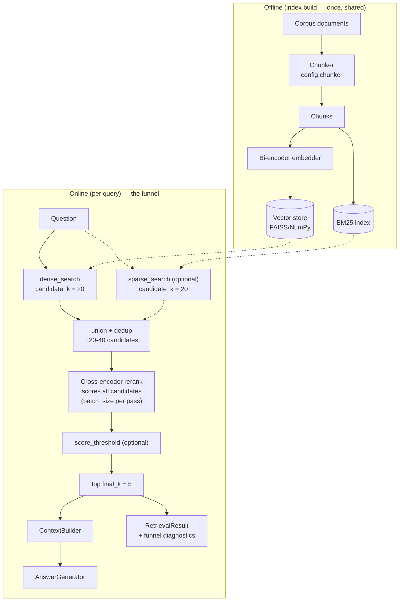

# Rerank RAG: architecture

Two-stage funnel: cheap high-recall candidate generation, then expensive high-precision
cross-encoder reranking over only those candidates.

## Data flow

The funnel narrows `whole corpus → candidate_k (≈20-40) → final_k (5)`: recall is bought cheaply
at the top, precision expensively at the bottom, and only over what the top surfaced.

## Components

| Component | File | Responsibility |
|---|---|---|
| `Config` | `config.py` | Frozen tunables; validates the funnel shape (`final_k ≤ candidate_k`) |
| `Reranker` (Protocol) | `reranker.py` | Structural contract: `rerank(query, chunks) -> chunks`, re-scored + re-sorted |
| `CrossEncoderReranker` | `reranker.py` | Lazy-loads `sentence_transformers.CrossEncoder`, batch-scores (query, index_text) pairs |
| `LexicalOverlapReranker` | `reranker.py` | Deterministic token-Jaccard double for offline tests; documented fallback |
| `RerankRetriever` | `retriever.py` | Funnel orchestration: candidates → union → rerank → threshold → cut; diagnostics |
| `Pipeline` | `pipeline.py` | Lifecycle + wiring: lazy index/reranker, context assembly, generation |

## Diagnostics (in `RetrievalResult.diagnostics`)

- `candidates`, total / dense / sparse / overlap counts: how wide stage 1 cast
- `rank_movement`, per final chunk: `stage1_rank → final_rank` and the delta; all-zero means the
  reranker changed nothing and is pure latency for this workload
- `top1_from_stage1_rank`, how deep the winner was hiding; the reranker's headline win, and an
  early warning that `candidate_k` must stay at least that deep
- `dropped_by_threshold`, `reranker` (name/model), `score_threshold`

## Failure modes

| Failure | Symptom | Cause / fix |
|---|---|---|
| **`candidate_k` too small** (the classic) | recall@k identical to naive; gold doc absent no matter the reranker | Stage 2 only reorders, it cannot recover what stage 1 missed. Raise `candidate_k`; watch `top1_from_stage1_rank` creeping toward `candidate_k` |
| Exact-token queries miss | ids/names absent from candidates | Bi-encoder vocabulary gap, set `use_sparse_candidates=True` to union BM25 in |
| Latency blowup | p95 grows linearly with `candidate_k` | Cross-encoder is O(candidates) forward passes; lower `candidate_k`, raise `batch_size`, or use a smaller model |
| Over-aggressive threshold | empty/short results, generator abstains | Cross-encoder logits are model-specific and uncalibrated, set `score_threshold` only after inspecting the score distribution |
| Domain shift | reranker demotes correct passages | MS MARCO training ≠ your domain; swap `cross_encoder_model` or fine-tune |
| Zero rank movement | rerank ≈ naive at extra cost | Stage 1 already orders well on this corpus; rerank isn't buying anything here |

## Tuning

| Knob | Default | Raise when | Lower when |
|---|---|---|---|
| `candidate_k` | 20 | `top1_from_stage1_rank` near the limit; recall low | latency-bound (cost is linear in it) |
| `use_sparse_candidates` | False | queries carry rare exact tokens (ids, jargon) | corpus is paraphrase-only; keep stage 1 minimal |
| `final_k` | 5 | context budget allows more evidence | precision matters more than recall |
| `cross_encoder_model` | ms-marco-MiniLM-L-6-v2 | quality-bound → L-12 or a larger reranker | latency-bound → TinyBERT variants |
| `batch_size` | 32 | GPU underutilized | memory pressure |
| `score_threshold` | None | reranked tail is confidently irrelevant (inspect scores first) | generator abstains on thin context |

## Citations

- Nogueira, R., & Cho, K. (2019). **Passage Re-ranking with BERT.** *arXiv:1901.04085.*, the
  retrieve-then-rerank funnel with a cross-encoder stage 2.
- Reimers, N., & Gurevych, I. (2019). **Sentence-BERT: Sentence Embeddings using Siamese
  BERT-Networks.** *EMNLP 2019.*, the bi-encoder/cross-encoder cost-quality distinction stage 1
  is built on.
- Bajaj, P., et al. (2016). **MS MARCO: A Human Generated MAchine Reading COmprehension
  Dataset.**, the training data behind the default `cross-encoder/ms-marco-MiniLM-L-6-v2`.
