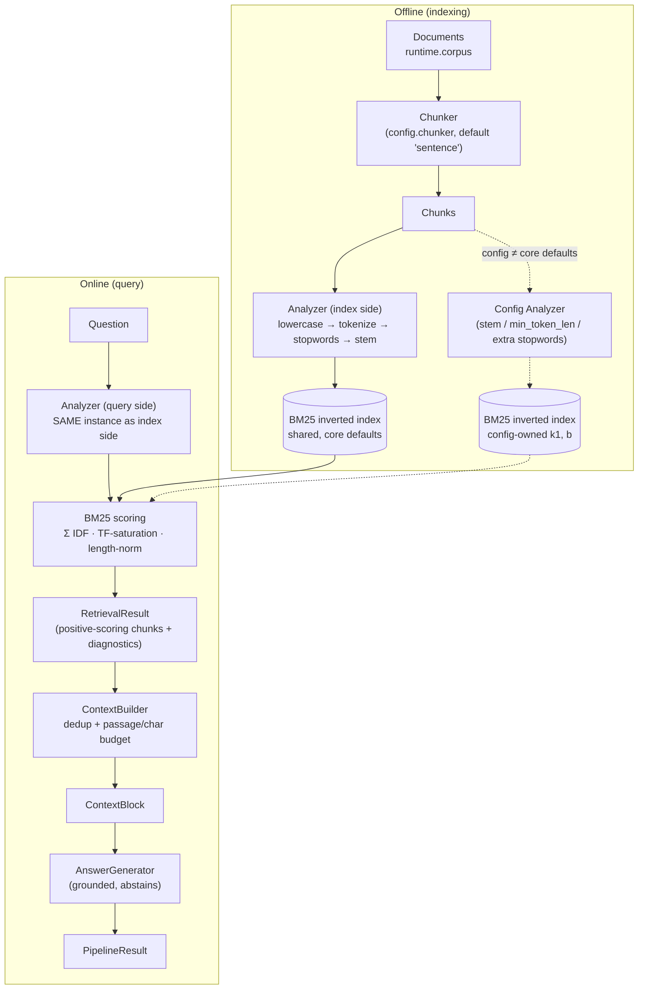

# sparse — architecture

Single-shot lexical retrieval with an explicit, config-owned analysis pipeline. The dashed path
below only exists when the config diverges from the core BM25 defaults.

## Data flow

## Components

| Component | File | Responsibility |
|---|---|---|
| `SparseConfig` | `config.py` | Scoring (k1, b) + analysis (stem, min_token_len, extra_stopwords) + retrieval/context knobs; `matches_core_defaults()` decides shared-vs-owned index |
| `BM25Retriever` | `retriever.py` | Query analysis (same `Analyzer` instance as the index — asymmetry unrepresentable), BM25 search, diagnostics (`query_terms`, scores, params, index provenance) |
| `Pipeline` | `pipeline.py` | Wires retriever → `ContextBuilder` → `AnswerGenerator`; lazy index and retriever construction; spans around every stage |
| `Analyzer` / `BM25Index` (core) | `core/stores/lexical.py` | The actual tokenizer/stemmer and Okapi scoring core; this package configures, never reimplements, them |

## Trace shape

`sparse.pipeline > sparse.retrieve > [sparse.build_bm25 (first tuned call only)], sparse.bm25_search, sparse.build_context > generate`

## Failure modes

| Failure | Symptom in the benchmark | Why it is structural |
|---|---|---|
| Vocabulary mismatch | recall 0 on paraphrased questions ("started" vs "founded") | BM25 scores literal term overlap; a synonym contributes exactly nothing. Dense retrieval (`naive/`) and fusion (`hybrid/`) are the fixes |
| Empty analyzed query | `diagnostics["query_terms"] == []`, zero hits | A question made entirely of stopwords/short tokens leaves nothing to search; over-aggressive `extra_stopwords` causes this too |
| Multi-hop questions | recall ≈ 0 on 2-hop items | One bag of terms, one shot — same structural limit as naive |
| Common-term domination | high-scoring but irrelevant hits | A corpus-ubiquitous query term with mid IDF outweighs the discriminative one; `extra_stopwords` is the lever |
| Stemmer over-merge | precision drop after enabling `stem` on code/ID corpora | Suffix stripping conflates distinct identifiers (`build-ing`, `logs`→`log`); turn `stem` off for technical corpora |

## Tuning

| Knob | Effect |
|---|---|
| `k1` ↓ (→ ~0.5) | Term frequency saturates fast — a term counts roughly once. Good for short chunks where repetition is noise |
| `k1` ↑ (→ ~2.0) | Repeated mentions keep adding score. Good when TF genuinely signals aboutness (long chunks) |
| `b` ↑ (→ 1.0) | Full length normalization — long chunks heavily penalized |
| `b` ↓ (→ 0.0) | No length penalty; use when the chunker already emits uniform lengths |
| `stem` off | Stricter, surface-exact matching — better for IDs/codes, worse for prose morphology |
| `extra_stopwords` | Kill corpus-ubiquitous terms that otherwise dominate scores; the highest-leverage knob |
| `min_token_len` ↑ | Drops short noise tokens, but also meaningful short terms — raise past 2 with care |
| `top_k` ↑ | More candidates, but BM25 only returns positive scores — the honest ceiling is the lexical overlap that exists |

Any change to k1/b/stem/min_token_len/extra_stopwords triggers a one-time config-owned index
build over the same chunks (`sparse.build_bm25` span, `custom_bm25_index: true` diagnostic) —
tuning is never a silent no-op.

## Reference

Robertson & Zaragoza, *The Probabilistic Relevance Framework: BM25 and Beyond*, Foundations and
Trends in Information Retrieval, 2009 — the definitive treatment of the Okapi BM25 scoring
function and its k1/b parameterization.
